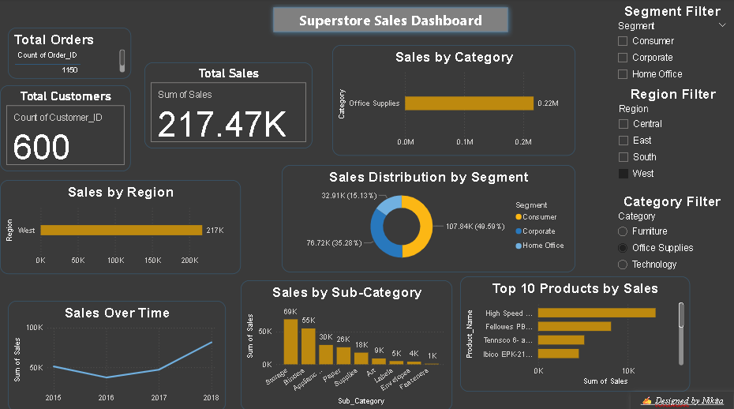

# Superstore Sales Dashboard

A **Power BI dashboard** project that analyzes Superstore sales data with rich, interactive visuals and slicers — designed for insight-driven decisions.

---

## Overview

This dashboard provides a detailed view of:

- **Total Orders**,  **Total Sales**, **Unique Customers**
- **Sales Trends over Time**
- **Category & Sub-category Sales Breakdown**
- **Region-wise Sales Analysis**
- **Segment-wise Distribution**
- **Top 10 Products by Sales**
- **Slicers** for filtering by Category, Region, and Segment

---

## Features

- Responsive **card visuals** for key KPIs
- Dynamic **bar/line/donut charts**
- User-friendly **slicer filters**
- Custom theme with modern design elements
- Optimized layout for recruiters and stakeholders

---

## Files Included

| File | Description |
|------|-------------|
| `Sales Performance Analysis.pbix` | Main Power BI file |
| `preview.png` | Dashboard screenshot |
| `README.md` | This file |

---

## Designed By

**Nikita Swain**  
_“Turning data into stories that make sense.”_

---

## Connect With Me

- [LinkedIn](https://www.linkedin.com/in/nikita-swain-3b2374315/)
- `nikitaswain03@gmail.com`

---

## License

This project is open for viewing and inspiration. Please do not use commercially without permission.
